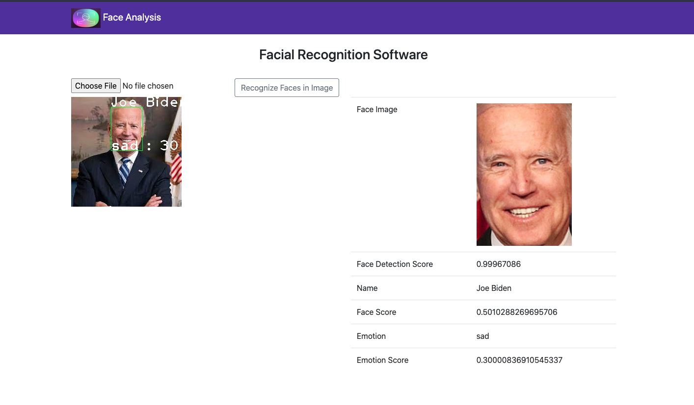

# Elevate_AI_Task 

This is a project for an AI/ML internship role in Elevate_AI x Moodme, in the web application, i made use of bootstrap for the frontend looks, and the major programming language is python and it's amazing libraries and framework

## How Final project looks

### How to run the project locally
    Make sure you have python installed globally on your machine,
    the following commands below works for a unix based machine.

    Follow the below steps to get started

- `sudo apt update`

- `git clone https://github.com/vortex-hue/elevateAI_Task.git`

- `cd Elevate_Ai_Task`

- `python3 -m venv env`

- `source env/bin/activate`

- `pip install -r requirements.txt`

- `chmod +x manage.py`

- `./manage.py runserver`

- visit localhost:8000

#### Visit Localhost to use the project
- the list of all installed packages is included in the requirements.txt file

- i also made use of some pretrained models, which can be found on the url below

- [openface](https://github.com/pyannote/pyannote-data/tree/master)

I also made use of some other pretrained models to speed the process
